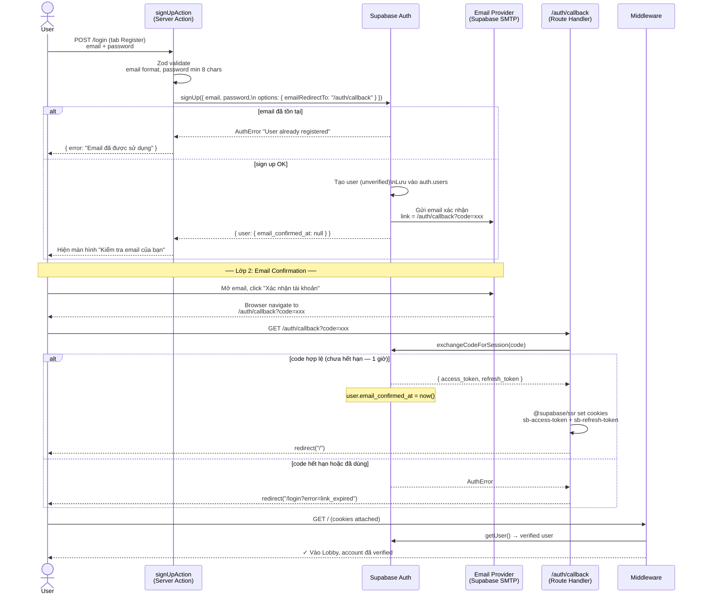
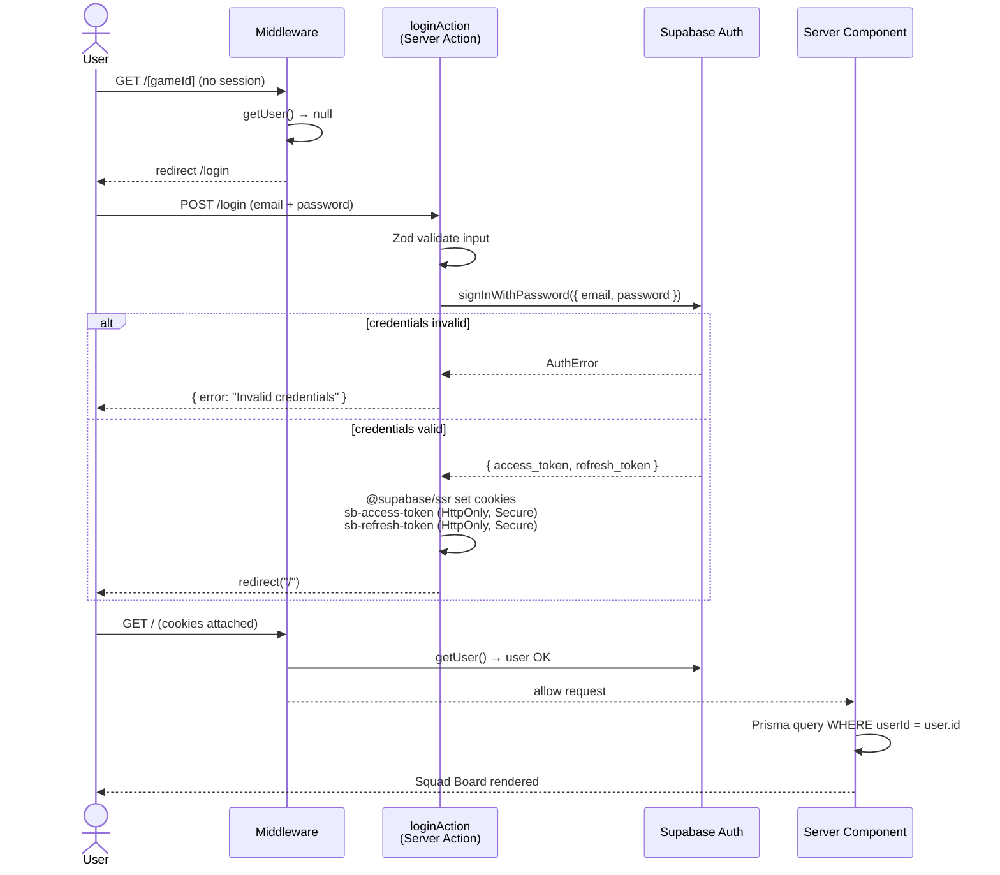
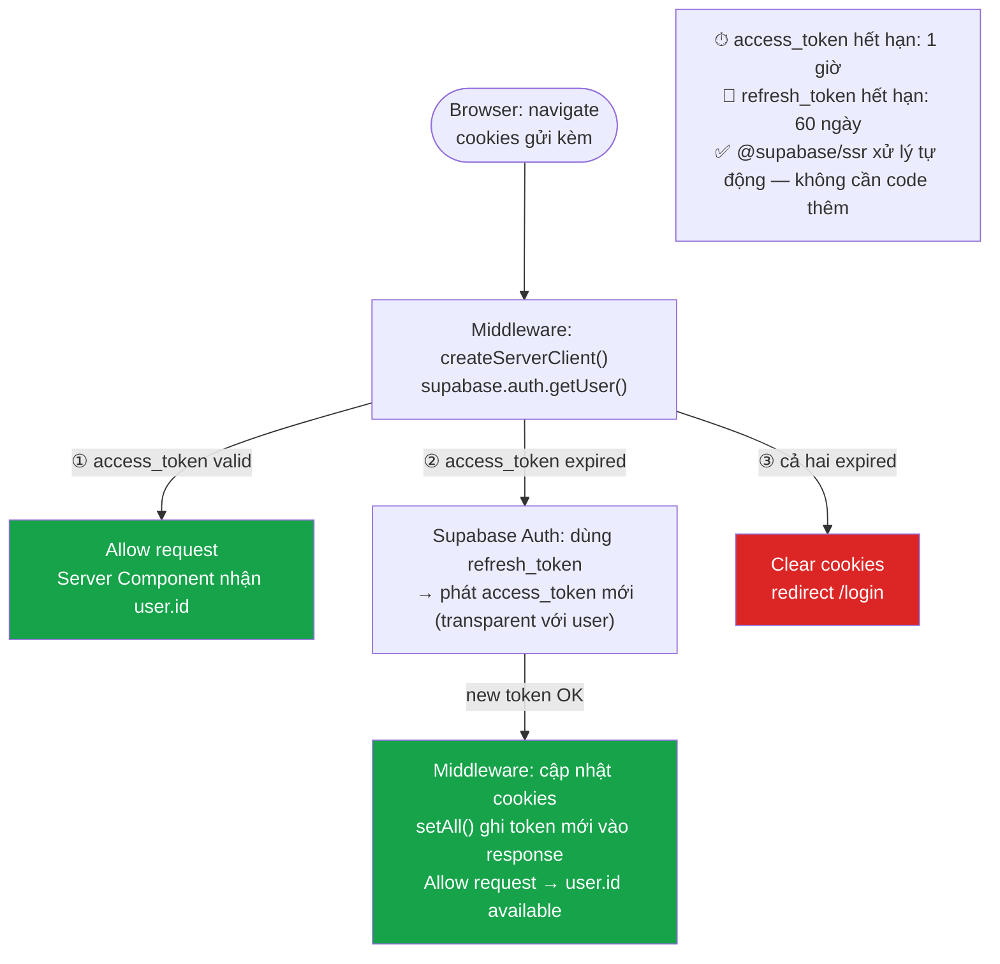
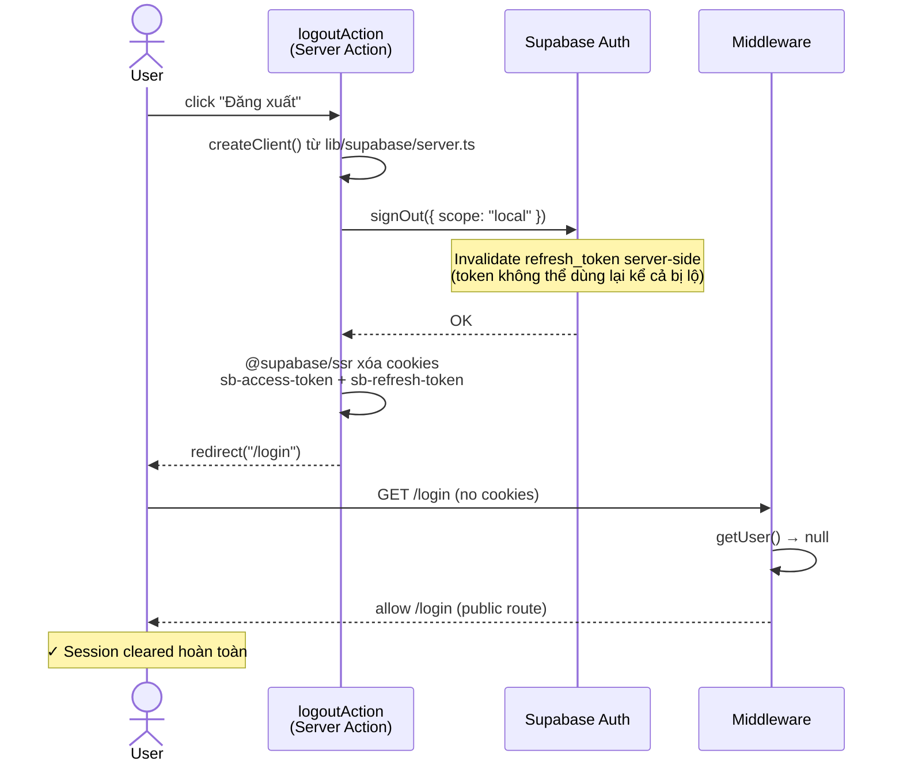

# Auth Implementation Plan — Football Life

> Đọc file này trước khi bắt đầu implement Auth. Đây là nguồn sự thật duy nhất cho phase Auth.

---

## Tổng quan chiến lược

Dùng **Supabase Auth** + **`@supabase/ssr`** cho Next.js 15 App Router.

- Cookie-based sessions (không phải localStorage) — tương thích với Server Components.
- Không dùng NextAuth. `NEXTAUTH_SECRET` trong `environment-variables.md` là tàn dư từ bản nháp ban đầu — **bỏ qua, không implement**.
- Auth chạy qua Supabase → JWT → Next.js Middleware verify → Server Components/Actions đọc user từ cookie.
- RLS trên Supabase là tầng bảo vệ thứ 2 (backup), không phải primary.

---

## Hiện trạng codebase (trước khi implement)

| Chỗ | Trạng thái |
|---|---|
| `GameSession.userId` | `String`, currently hardcode `"anonymous"` |
| `features/game/actions/createGameSession.ts:42` | `userId: "anonymous"` |
| `app/(game)/page.tsx` | `findMany` game sessions **không filter userId** |
| `app/(game)/[gameId]/page.tsx` | Không verify session thuộc về user |
| `app/(game)/[gameId]/draft/[slotIndex]/page.tsx` | Không verify |
| Tất cả Server Actions (`season.actions.ts`, `player.actions.ts`) | Không có auth check |
| `lib/supabase/` | **Chưa tồn tại** |
| `app/(auth)/` | **Chưa tồn tại** |
| `middleware.ts` | **Chưa tồn tại** |
| `@supabase/supabase-js`, `@supabase/ssr` | **Chưa được cài** |

---

## Packages cần cài

```bash
npm install @supabase/supabase-js @supabase/ssr
```

Không cần: `next-auth`, `bcrypt`, `jose` — Supabase tự handle JWT.

---

## Files cần tạo mới

```
lib/
  supabase/
    client.ts          ← Browser client (dùng anon key)
    server.ts          ← Server client (dùng cookies, cho Server Components)
    middleware.ts      ← Supabase session refresh helper

middleware.ts          ← Next.js Middleware (root level — bảo vệ routes)

app/
  (auth)/
    layout.tsx         ← Layout cho auth pages (không có game sidebar)
    login/
      page.tsx         ← Login + Register form (email/password)
    auth/
      callback/
        route.ts       ← OAuth/Magic Link callback handler
```

---

## Files cần sửa

| File | Thay đổi |
|---|---|
| `features/game/actions/createGameSession.ts` | Lấy `userId` từ Supabase session thay vì `"anonymous"` |
| `app/(game)/page.tsx` | Filter `findMany` by `userId` |
| `app/(game)/[gameId]/page.tsx` | Verify `gameSession.userId === currentUser.id` |
| `app/(game)/[gameId]/draft/[slotIndex]/page.tsx` | Tương tự |
| `actions/season.actions.ts` | Thêm ownership check trong `saveSeasonProgress`, `updateSeasonProgressAction` |
| `actions/player.actions.ts` | Thêm ownership check trong `initCareerPlayerAction`, `saveCareerPlayer` |

---

## Chi tiết implementation

### Bước 1 — Tạo Supabase clients

**`lib/supabase/client.ts`** — Dùng trong Client Components:
```ts
import { createBrowserClient } from "@supabase/ssr";

export function createClient() {
  return createBrowserClient(
    process.env.NEXT_PUBLIC_SUPABASE_URL!,
    process.env.NEXT_PUBLIC_SUPABASE_ANON_KEY!
  );
}
```

**`lib/supabase/server.ts`** — Dùng trong Server Components, Server Actions, Middleware:
```ts
import { createServerClient } from "@supabase/ssr";
import { cookies } from "next/headers";

export async function createClient() {
  const cookieStore = await cookies();
  return createServerClient(
    process.env.NEXT_PUBLIC_SUPABASE_URL!,
    process.env.NEXT_PUBLIC_SUPABASE_ANON_KEY!,
    {
      cookies: {
        getAll: () => cookieStore.getAll(),
        setAll: (cookiesToSet) => {
          try {
            cookiesToSet.forEach(({ name, value, options }) =>
              cookieStore.set(name, value, options)
            );
          } catch {} // Server Component context — ignore set errors
        },
      },
    }
  );
}
```

---

### Bước 2 — Middleware bảo vệ routes

**`middleware.ts`** (root):
```ts
import { createServerClient } from "@supabase/ssr";
import { NextResponse, type NextRequest } from "next/server";

export async function middleware(request: NextRequest) {
  let supabaseResponse = NextResponse.next({ request });

  const supabase = createServerClient(
    process.env.NEXT_PUBLIC_SUPABASE_URL!,
    process.env.NEXT_PUBLIC_SUPABASE_ANON_KEY!,
    {
      cookies: {
        getAll: () => request.cookies.getAll(),
        setAll: (cookiesToSet) => {
          cookiesToSet.forEach(({ name, value }) =>
            request.cookies.set(name, value)
          );
          supabaseResponse = NextResponse.next({ request });
          cookiesToSet.forEach(({ name, value, options }) =>
            supabaseResponse.cookies.set(name, value, options)
          );
        },
      },
    }
  );

  // Refresh session — QUAN TRỌNG: phải gọi trước khi dùng session
  const { data: { user } } = await supabase.auth.getUser();

  // Redirect unauthenticated users từ game routes về login
  if (!user && !request.nextUrl.pathname.startsWith("/login") && !request.nextUrl.pathname.startsWith("/auth")) {
    return NextResponse.redirect(new URL("/login", request.url));
  }

  return supabaseResponse;
}

export const config = {
  matcher: [
    "/((?!_next/static|_next/image|favicon.ico|.*\\.(?:svg|png|jpg|jpeg|gif|webp)$).*)",
  ],
};
```

---

### Bước 3 — Login/Register page

**`app/(auth)/login/page.tsx`** — dùng Supabase `signInWithPassword` + `signUp`.

Auth method được chọn: **Email + Password** (đơn giản nhất, không cần Google OAuth setup).

Optional thêm sau: Magic Link (`signInWithOtp`), Google OAuth.

```ts
// Trong Server Action của form login:
const supabase = await createClient(); // lib/supabase/server.ts
const { error } = await supabase.auth.signInWithPassword({ email, password });
if (error) return { error: error.message };
redirect("/");
```

---

### Bước 4 — Callback route (cho Magic Link / OAuth nếu dùng sau)

**`app/(auth)/auth/callback/route.ts`**:
```ts
import { NextResponse } from "next/server";
import { createClient } from "@/lib/supabase/server";

export async function GET(request: Request) {
  const { searchParams, origin } = new URL(request.url);
  const code = searchParams.get("code");

  if (code) {
    const supabase = await createClient();
    await supabase.auth.exchangeCodeForSession(code);
  }

  return NextResponse.redirect(`${origin}/`);
}
```

---

### Bước 5 — Lấy userId trong Server Actions

**Pattern chuẩn** (áp dụng vào mọi action cần auth):
```ts
import { createClient } from "@/lib/supabase/server";

export async function someAction(input: unknown) {
  // 1. Auth check — LUÔN đặt đầu tiên
  const supabase = await createClient();
  const { data: { user } } = await supabase.auth.getUser();
  if (!user) throw new Error("Unauthorized");

  // 2. Validate input
  const validated = someSchema.parse(input);

  // 3. Ownership check (với operations liên quan đến gameId)
  const session = await prisma.gameSession.findUnique({
    where: { id: validated.gameId },
    select: { userId: true },
  });
  if (session?.userId !== user.id) throw new Error("Forbidden");

  // 4. Proceed
}
```

---

### Bước 6 — Server Components: lấy user + filter data

```ts
// app/(game)/page.tsx
import { createClient } from "@/lib/supabase/server";

export default async function LobbyPage() {
  const supabase = await createClient();
  const { data: { user } } = await supabase.auth.getUser();
  // middleware đã đảm bảo user tồn tại khi đến đây

  const sessions = await prisma.gameSession.findMany({
    where: { userId: user!.id },  // ← thêm dòng này
    orderBy: { createdAt: "desc" },
    include: { _count: { select: { players: true } } },
  });
  // ...
}
```

---

## Auth Flow Diagrams

### Flow 0 — Sign Up (2 lớp verify)



> **Lưu ý**:
> - Email confirmation link hết hạn sau **1 giờ** (cấu hình được trong Supabase Dashboard → Auth → Email Templates).
> - Nếu user không nhận được email: thêm nút "Gửi lại email xác nhận" gọi `supabase.auth.resend({ type: "signup", email })`.
> - `emailRedirectTo` phải được thêm vào **Redirect URLs** trong Supabase Dashboard → Auth → URL Configuration.

---

### Flow 1 — Login



---

### Flow 2 — Token Refresh (tự động, mỗi request)



> **Lưu ý**: `@supabase/ssr` xử lý toàn bộ refresh cycle — không cần viết logic refresh thủ công. Chỉ cần gọi `getUser()` trong middleware là đủ.

---

### Flow 3 — Logout



> **scope options**: `"local"` (default) — chỉ thiết bị này. `"global"` — kick khỏi mọi thiết bị (dùng cho "Đăng xuất khỏi tất cả thiết bị").

---

## Thứ tự implement

**Làm theo thứ tự này — mỗi bước independent, có thể test riêng:**

1. `npm install @supabase/supabase-js @supabase/ssr`
2. Tạo `lib/supabase/client.ts` và `lib/supabase/server.ts`
3. Tạo `middleware.ts` (session refresh, route protection)
4. Tạo `app/(auth)/login/page.tsx` (form login/register)
5. Tạo `app/(auth)/auth/callback/route.ts`
6. Update `createGameSession.ts` — lấy userId thật
7. Update `app/(game)/page.tsx` — filter by userId
8. Update `app/(game)/[gameId]/page.tsx` — verify ownership
9. Update `app/(game)/[gameId]/draft/[slotIndex]/page.tsx` — verify ownership
10. Update `actions/player.actions.ts` — auth + ownership checks
11. Update `actions/season.actions.ts` — auth + ownership checks
12. (Optional) Enable Supabase RLS trên bảng `game_sessions` và `career_players`

---

## Supabase RLS (Optional — tầng bảo vệ thứ 2)

Nếu implement RLS, thêm vào Supabase dashboard:

```sql
-- game_sessions: chỉ owner xem/sửa được
ALTER TABLE game_sessions ENABLE ROW LEVEL SECURITY;

CREATE POLICY "Users can only see their own sessions"
  ON game_sessions FOR ALL
  USING (auth.uid()::text = user_id);

-- career_players: inherit từ game_sessions qua cascade
ALTER TABLE career_players ENABLE ROW LEVEL SECURITY;

CREATE POLICY "Users can only access players in their sessions"
  ON career_players FOR ALL
  USING (
    EXISTS (
      SELECT 1 FROM game_sessions
      WHERE game_sessions.id = career_players.game_session_id
        AND game_sessions.user_id = auth.uid()::text
    )
  );
```

**Lưu ý**: RLS dùng `anon key`. Các server actions dùng `service_role key` sẽ bypass RLS — đó là lý do ownership check trong Server Actions là primary defense, còn RLS là backup.

---

## Env vars cần có trước khi bắt đầu

```env
NEXT_PUBLIC_SUPABASE_URL="https://[PROJECT_REF].supabase.co"
NEXT_PUBLIC_SUPABASE_ANON_KEY="eyJ..."
NEXT_PUBLIC_APP_URL="http://localhost:3000"
```

`SUPABASE_SERVICE_ROLE_KEY` và `SUPABASE_JWT_SECRET` — chỉ cần nếu implement RLS bypass hoặc verify JWT thủ công. **Không cần cho basic auth flow.**

---

## Không làm trong phase này

- OAuth (Google, GitHub) — thêm sau khi basic email/password chạy ổn
- Email verification flow phức tạp
- Password reset UI (Supabase cung cấp built-in flow, link vào là đủ)
- Multi-tenant / team features
- Admin panel

---

## Kiểm tra xong khi

- [ ] User đăng ký được và thấy squad board trống
- [ ] User logout rồi vào `/` bị redirect về `/login`
- [ ] User A không xem được session của User B (thử đoán UUID)
- [ ] `createGameSession` tạo record với `userId` thật (không phải `"anonymous"`)
- [ ] Lobby chỉ hiện sessions của user đang đăng nhập
- [ ] Server Actions trả về `Unauthorized` khi gọi không có session
