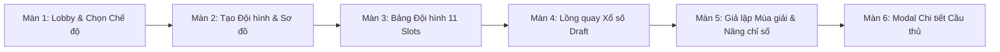

# Lộ Trình Triển Khai Giao Diện (UI Implementation Roadmap)

Tài liệu này vạch ra thứ tự xây dựng các màn hình giao diện (UI screens) của **Football Life** theo trình tự phụ thuộc dữ liệu (data dependencies) và luồng đi của người chơi (user journey).

---

## 1. Thứ tự Ưu tiên Triển khai (Implementation Order)

Chúng ta cần xây dựng giao diện từ màn hình khởi đầu đến màn hình gameplay chính để đảm bảo dữ liệu chạy thông suốt:

---

## 2. Chi Tiết Từng Phase Thiết Kế & Code

### 2.1. Phase 1: Màn hình Bắt đầu & Tạo mới (Lobby & Squad Creation)
*Đây là cửa ngõ của trò chơi. Nếu không có màn hình này, bạn sẽ không thể chọn hoặc sinh ra một `gameSessionId` để liên kết với các thẻ cầu thủ.*

- **Màn hình 1: Start Screen (Lobby)**
  - Chức năng: Nhấp chọn `Classic Mode`. Nút còn lại (`Almanac Mode`) hiển thị trạng thái `Coming Soon` (disabled).
  - Vị trí file đề xuất: `app/(game)/page.tsx`
- **Màn hình 2: Squad List & Creation Dialog**
  - Chức năng:
    - Hiển thị danh sách các đội hình đã được lưu trong database.
    - Nhấp nút `NEW SQUAD` sẽ mở một modal dialog để nhập tên đội hình (ví dụ: *RTG FC*) và chọn sơ đồ đội hình (ví dụ: *4-3-3*).
    - Lưu vào DB thông qua Server Action `createGameSession`.
  - Vị trí file đề xuất: `features/game/components/GameList.tsx` và `features/game/components/CreateGameDialog.tsx`

---

### 2.2. Phase 2: Bảng Quản lý Đội hình (Squad Management Board)
*Màn hình trung tâm (Hub) hiển thị sơ đồ 11 vị trí.*

- **Màn hình 3: Squad Board (SQUAD tab)**
  - Chức năng:
    - Nhận `gameSessionId` từ URL và render tactical pitch (sơ đồ 4-3-3, 4-4-2...).
    - 11 ô vị trí trống hiển thị dạng nét đứt, nhấp vào sẽ kích hoạt luồng Draft.
    - Hiển thị thông tin HLV (Manager card dạng sticker), tài chính (`Funds`), danh sách dự bị (`Substitutes`) dạng nhãn dán Panini nằm ngang ở chân trang.
    - Nút `PLAY MATCH` bị vô hiệu hóa (disabled) cho đến khi đủ 11/11 cầu thủ đá chính.
  - Vị trí file đề xuất: `app/(game)/[gameId]/page.tsx` và `features/squad/components/SquadBoard.tsx`

---

### 2.3. Phase 3: Buồng Bốc Thăm & Sinh Cầu Thủ (Draft Lottery Drum Flow)
*Luồng thiết lập cầu thủ thông qua 6 vòng quay lồng gỗ cổ điển.*

- **Màn hình 4: Draft Setup Screen**
  - Chức năng:
    - Nhấp vào ô trống trên sân sẽ mở giao diện bốc thăm này.
    - Bên trái là lồng quay xổ số (`Tombola/Lottery Drum`) vẽ bằng SVG/CSS phẳng, bên phải là phôi sticker Panini trống.
    - Cho phép quay 6 lần liên tiếp để điền đầy đủ các thông tin: Quốc tịch, Tuổi ra mắt, OVR ra mắt, Số năm sự nghiệp, Giải đấu, Câu lạc bộ.
    - Gọi Server Action `saveCareerPlayer` để tính toán chỉ số, lưu vào database và chuyển hướng ngược lại **Squad Board** (ô vị trí rỗng nay đã được lấp đầy bằng thẻ cầu thủ có hình ảnh chân dung cổ điển).
  - Vị trí file đề xuất: `features/wheel/components/DraftDrumScreen.tsx`

---

### 2.4. Phase 4: Vòng Lặp Giả Lập & Tiến Trình Mùa Giải (Simulation Loop & Progression)
*Tiến trình chơi game chính sau khi đã đủ đội hình.*

- **Màn hình 5: Match Simulation & Year-end Progress**
  - Chức năng:
    - Khi nhấp `PLAY MATCH` từ bảng đội hình, giao diện chuyển sang chế độ giả lập.
    - Hiển thị bảng mô phỏng lịch đấu, tin tức báo chí cập nhật và BXH.
    - Cuối năm: Hiện bảng thăng tiến chỉ số, cho quay lồng để nâng/hạ OVR/Stats cho từng cầu thủ trong đội hình.
  - Vị trí file đề xuất: `features/season/components/SimulationScreen.tsx`

---

### 2.5. Phase 5: Modal Chi Tiết Cầu Thủ (Player Profile Modal)
*Chi tiết lịch sử và biểu đồ thăng tiến.*

- **Màn hình 6: Player Career Dialog**
  - Chức năng:
    - Nhấp vào một thẻ cầu thủ bất kỳ trên sân bóng sẽ mở modal này lên.
    - Hiển thị thẻ Panini phóng to và Biểu đồ đường (`Line Chart` OVR) vẽ trên nền giấy kẻ ô li cổ điển, kèm theo timeline các sự kiện (danh hiệu, chuyển nhượng) trong sự nghiệp của họ.
  - Vị trí file đề xuất: `features/player/components/PlayerCareerDialog.tsx`

---

## 3. Các File Tài liệu Kỹ thuật Tương ứng

* Xem chi tiết luồng UI/UX: [ui-ux-flow.md](file:///d:/road-to-glory/docs/ui-ux-flow.md).
* Xem thiết kế logic và data models: [game-design.md](file:///d:/road-to-glory/docs/game-design.md).
