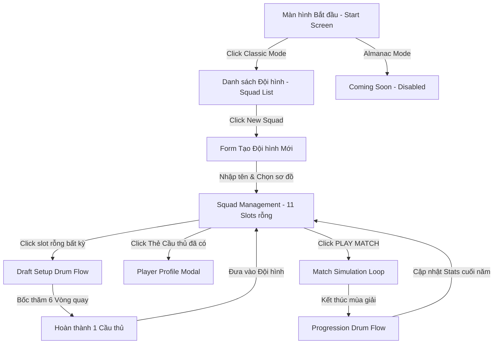

# Football Life — UI/UX Flow Document

Tài liệu này mô tả chi tiết luồng trải nghiệm người dùng (UX Flow) và cấu trúc giao diện (UI Layout) của dự án **Football Life** (tên thư mục gốc: `road-to-glory`), dựa trên thiết kế phong cách **Retro Editorial / Panini Sticker Album** cổ điển.

---

## 1. Ngôn Ngữ Thiết Kế & Visual Theme
- **Màu sắc chủ đạo**: Nền giấy báo cũ màu kem (#F5F2EB), viền đen mỏng (solid 1px #000000 hoặc #27272a), chữ màu đen đậm (#000000), màu nhấn chính đỏ cam (#FF5A43) cho các nút hành động khẩn cấp (Play Match, Spin, Edit).
- **Thẻ cầu thủ (Panini Sticker Style)**: Mỗi cầu thủ dự bị/chính thức được vẽ như một nhãn dán Panini thực tế: có viền trắng dày, logo câu lạc bộ, cờ quốc gia, ảnh chụp chân dung kiểu hoài cổ (retro photo) và chỉ số OVR in góc dưới.
- **Sân bóng**: Thiết kế 2D phẳng, sử dụng sọc cỏ xanh lá cây tự nhiên, các vị trí là nút bấm dạng capsule trắng sữa tinh tế.

---

## 2. Bản Đồ Luồng Giao Diện (UI Flow Map)

---

## 3. Chi Tiết Từng Bước Trải Nghiệm (Step-by-Step UI/UX Flow)

### 3.1. Bước 1: Màn hình Bắt đầu & Chọn Chế độ (Game Start & Mode Selection)
*Đây là trang Landing Page khi người chơi mới truy cập vào game.*

- **Layout**: 
  - Phong cách trang bìa tạp chí thể thao cổ điển (Retro Newspaper Cover). Tiêu đề lớn **ROAD TO GLORY** hoặc **FOOTBALL LIFE** bằng chữ hoa Slab đậm màu đen.
  - Hình minh họa vẽ tay cầu thủ bóng đá retro đang sút bóng.
- **Tương tác**:
  - Gồm 2 nút lựa chọn chế độ lớn ở trung tâm:
    1. **CLASSIC MODE** (Đang hoạt động): Nút màu đỏ cam nổi bật, click vào sẽ dẫn đến màn hình danh sách đội hình.
    2. **ALMANAC MODE** (Chưa hoạt động): Có nhãn nhỏ ghi `COMING SOON`, trạng thái mờ (disabled) và không thể click.

### 3.2. Bước 2: Màn hình Danh sách Đội hình & Tạo mới (Squad List & Creation)
*Hiển thị sau khi người chơi chọn chế độ Classic Mode.*

- **Layout**:
  - Danh sách các Đội hình đã tạo (`Game Sessions`) được trình bày thành các hàng thẻ phẳng gọn gàng.
  - Mỗi hàng thẻ hiển thị: Tên đội hình (ví dụ: *RTG FC*), Ngày tạo, Điểm OVR trung bình (nếu có), và tiến độ hoàn thành đội hình (ví dụ: *Draft Progress: 4/11 players*).
- **Tương tác**:
  - Ở đầu danh sách có một nút nổi bật: **NEW SQUAD** (Tạo Đội hình Mới).
  - Khi click vào **NEW SQUAD**:
    - Mở một Pop-up Form (Dialog) yêu cầu nhập tên đội hình (ví dụ: *RTG FC*) và lựa chọn sơ đồ chiến thuật mặc định (ví dụ: *4-3-3*, *4-4-2*, *3-5-2*).
    - Sau khi xác nhận (Submit), hệ thống sẽ tạo Game Session mới trên DB và chuyển hướng người chơi đến **Màn hình Quản lý Đội hình**.

### 3.3. Bước 3: Màn hình Quản lý Đội hình (Squad Management Screen)
*Màn hình chính của trận đấu, hiển thị sơ đồ sân bóng với 11 vị trí.*

1. **Giai đoạn Đội hình chưa đầy đủ (Drafting Phase)**:
   - Sân bóng hiển thị 11 vị trí dưới dạng các ô trống dạng capsule trắng nét đứt (ví dụ: *GK*, *LB*, *CB*).
   - Người chơi click vào bất kỳ slot trống nào để bắt đầu bốc thăm cầu thủ cho vị trí đó $\rightarrow$ Chuyển sang **Luồng Bốc Thăm (Draft Drum Flow)**.
2. **Thanh Điều Hướng (Top Navigation)**:
   - Các tab: `DASHBOARD` | `SQUAD` (Active) | `TACTICS` | `TRANSFERS` | `CLUB` | `COMPETITIONS`.
   - Box thông tin CLB ở góc phải: Logo câu lạc bộ dạng khiên cổ điển, tên CLB (`RTG FC`), Năm thành lập, Trạng thái (Legend in Progress), Mùa giải hiện tại (`SEASON 1`).
3. **Cột thông tin Quản lý (Left Sidebar)**:
   - Sticker Huấn luyện viên (`MANAGER`): Trình bày như một nhãn dán retro chân dung HLV, quốc tịch, phong cách chiến thuật (`Control Possession`), và sơ đồ đội hình (`4-3-3`).
   - Tài chính CLB (`CLUB FUNDS`): Hiện số tiền, ví dụ: `€45.2M`.
   - Điểm tin cậy (`FAN CONFIDENCE`): Xếp hạng sao (1 - 5 sao).
   - Nút `CLUB OVERVIEW`: Đi đến chi tiết tài chính/cơ sở vật chất.
4. **Cột Trận đấu & BXH (Right Sidebar)**:
   - Box Trận đấu tiếp theo (`UPCOMING FIXTURE`): Chi tiết đối thủ (ví dụ: Inter), thời gian, địa điểm.
   - Bảng xếp hạng thu nhỏ (`LEAGUE TABLE`): Điểm số và vị trí của đội.
   - Danh sách ghi bàn (`TOP SCORERS`): Ảnh thẻ tròn nhỏ và số bàn thắng.
   - Nút `PLAY MATCH` màu đỏ cam: Nhấn để bắt đầu giả lập trận đấu / tiến trình mùa giải (nút này chỉ sáng lên khi đã draft đủ 11 cầu thủ).
5. **Khu vực Dự bị (Bottom Panel)**:
   - **SUBSTITUTES**: Danh sách cầu thủ dự bị dưới dạng các Sticker Panini xếp ngang.
   - **RESERVES**: Các slot thẻ trống ghi `RTG - ADD PLAYER`. Nhấp vào đây cũng kích hoạt luồng Draft cầu thủ mới.

### 3.4. Bước 4: Luồng Bốc Thăm Cầu Thủ Mới (Draft Setup Drum Flow)
*Kích hoạt khi click vào một slot trống trên sân hoặc phần Reserves.*

- **UI Layout**: Giao diện chuyển thành một phòng bốc thăm cổ điển. 
  - Bên trái là một chiếc **Lồng quay xổ số bằng gỗ/kim loại (Tombola Drum/Lottery Drum)** cổ điển.
  - Bên phải là một phôi nhãn dán Panini trống (`Blank Sticker`).
- **Tương tác**:
  - Người chơi click vào tay quay của lồng để quay. Lồng quay tròn và nhả ra một quả bóng chứa kết quả.
  - Quá trình này lặp lại **6 lần** cho 6 thuộc tính:
    1. **Quốc tịch** (Lồng thả ra bóng quốc tịch $\rightarrow$ Cờ đất nước được in lên phôi thẻ).
    2. **Tuổi ra mắt (Debut Age)** (Bóng tuổi $\rightarrow$ In số tuổi lên phôi thẻ).
    3. **OVR ra mắt** (In chỉ số ban đầu).
    4. **Số năm sự nghiệp (Career Length)** (Xác định năm giải nghệ dự kiến).
    5. **Giải đấu gia nhập (League)**.
    6. **Câu lạc bộ gia nhập (Club)** (In logo CLB lên phôi thẻ).
  - Sau lần quay thứ 6, thẻ cầu thủ Panini được tô màu hoàn chỉnh theo Rarity (Bronze, Gold, v.v.), có ảnh chân dung và tên được tạo ngẫu nhiên, sau đó thẻ này trượt (slide animation) vào vị trí dự bị trên bàn quản lý đội hình.

### 3.5. Bước 5: Luồng Giả Lập Trận Đấu & Tiến Trình Sự Nghiệp (Yearly Simulation Loop)
*Kích hoạt khi nhấn nút **PLAY MATCH** sau khi đã có đủ 11 cầu thủ.*

- **Mô phỏng trong năm**: 
  - Hệ thống BE tự động chạy giả lập toàn bộ trận đấu của mùa giải. 
  - UI hiển thị màn hình báo cáo dạng tờ báo tin tức (Newspaper Match Report) chạy các dòng chữ kết quả trận đấu nổi bật, bảng xếp hạng cập nhật và các sự kiện chấn thương/thẻ phạt.
- **Cuối mùa giải (Year-end Progression)**:
  - Đối với các cầu thủ trong đội hình, giao diện sẽ hiển thị bảng tiến trình chỉ số.
  - Người chơi quay **Lồng quay Tiến trình (Progression Drum)** cho từng cầu thủ để quyết định:
    1. **Chiều hướng OVR** (Tăng / Giảm / Giữ nguyên).
    2. **Số lượng chỉ số phụ bị ảnh hưởng**.
    3. **Biên độ thay đổi** (+/- bao nhiêu chỉ số).
  - Nếu cầu thủ đạt danh hiệu cá nhân lớn hoặc có đề nghị chuyển nhượng, giao diện sẽ hiện Pop-up dạng thư mời/báo chí cổ điển để người chơi lựa chọn (Đồng ý/Từ chối chuyển nhượng).

### 3.6. Bước 6: Modal Chi Tiết Sự Nghiệp Cầu Thủ (Player Career Modal)
*Mở ra khi click vào bất kỳ thẻ cầu thủ nào.*

- **Bên trái**: Thẻ Panini phóng to của cầu thủ (thể hiện OVR cao nhất/Peak OVR đạt được trong sự nghiệp) kèm thông tin cơ bản.
- **Bên phải**: 
  - Biểu đồ đường (`Line Chart`) OVR Progression vẽ trên nền giấy kẻ ô li cổ điển, hiển thị sự thăng trầm OVR qua các năm tuổi.
  - Timeline sự nghiệp liệt kê chi tiết các mốc thời gian: số trận, bàn thắng/kiến tạo, các câu lạc bộ đã đi qua, và các danh hiệu lớn đạt được trong mỗi năm.

---

## 5. Cách Liên Kết Các Tài Liệu Kỹ Thuật Liên Quan

* Để cấu hình trọng số cho chiếc lồng quay, xem: [`lib/wheel-engine/`](file:///d:/road-to-glory/lib/wheel-engine/weight-calculator.ts).
* Để xem luồng lưu trữ state giữa lồng quay và server, xem: [state-management.md](file:///d:/road-to-glory/docs/state-management.md).
* Để xem các cấu trúc dữ liệu schema của CareerPlayer và ClubStint, xem: [`prisma/schema.prisma`](file:///d:/road-to-glory/prisma/schema.prisma).
